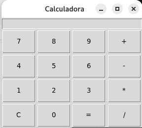

# Calculadora em Python com Tkinter

## Sobre o projeto

Este projeto consiste em uma calculadora desenvolvida em Python utilizando a biblioteca Tkinter para a criação da interface gráfica.

O objetivo principal foi praticar conceitos fundamentais de programação, incluindo:

* Programação Orientada a Objetos (POO)
* Interfaces gráficas com Tkinter
* Tratamento de exceções
* Estruturas de repetição
* Funções e métodos
* Manipulação de strings

## Funcionalidades

* Operações de adição (+)
* Operações de subtração (-)
* Operações de multiplicação (*)
* Operações de divisão (/)
* Limpeza do visor
* Tratamento de expressões inválidas
* Bloqueio de operadores consecutivos
* Interface gráfica intuitiva

## Tecnologias utilizadas

* Python 3
* Tkinter

## Aprendizados

Durante o desenvolvimento deste projeto foram praticados conceitos importantes de Python, como:

* Classes e objetos
* Métodos e atributos
* Eventos de interface gráfica
* Organização de código
* Validação de entradas
* Tratamento de erros com try/except

## Melhorias futuras

* Adicionar botão para apagar o último caractere (⌫)
* Suporte a números decimais
* Suporte ao teclado
* Histórico de operações
* Melhorias visuais na interface

## Autor

Desenvolvido por Thiago Costa como projeto de estudo e prática em Python.

## Interface

